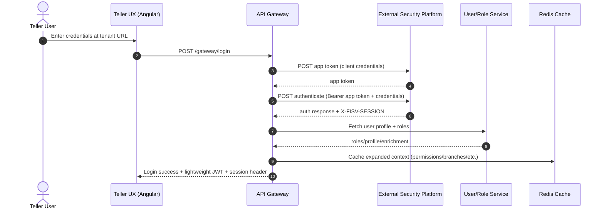
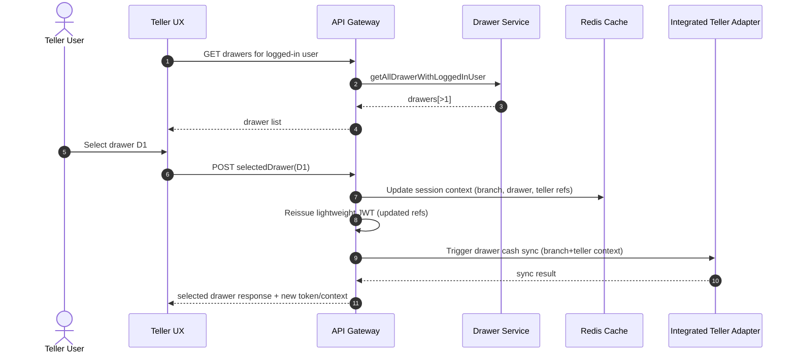
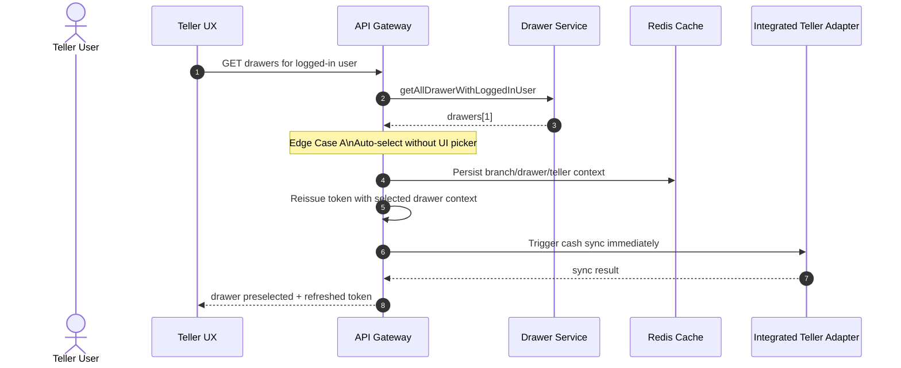
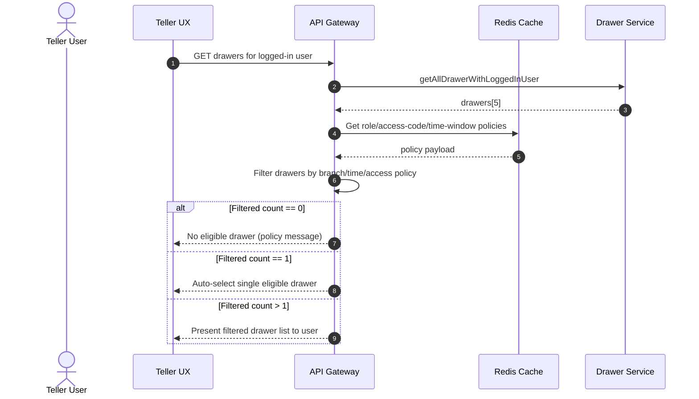
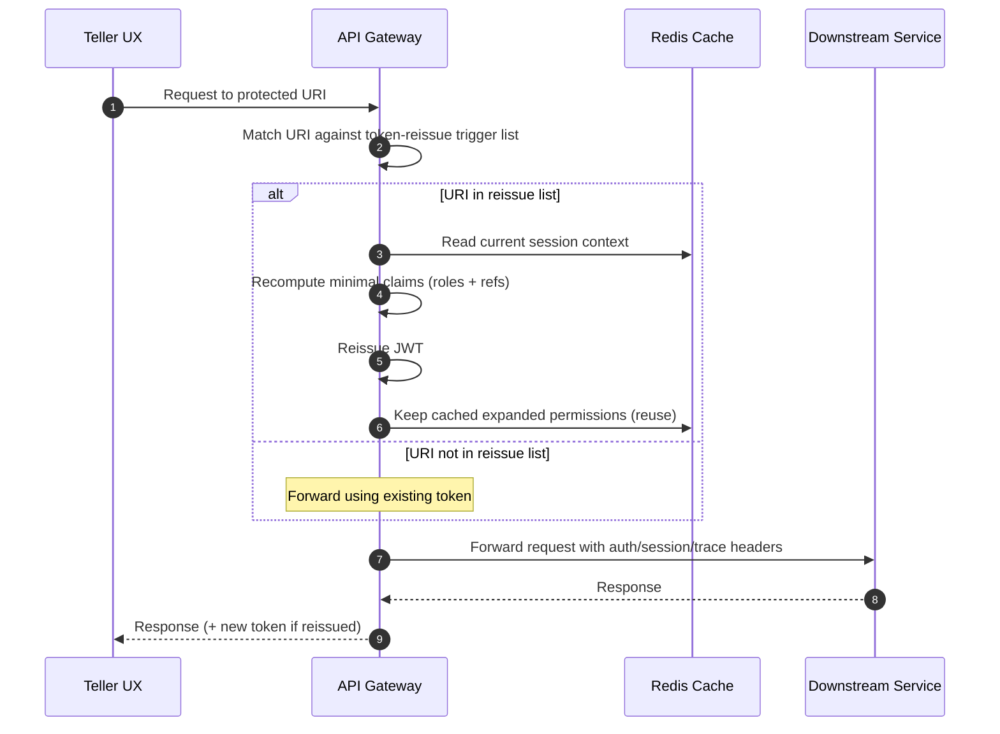
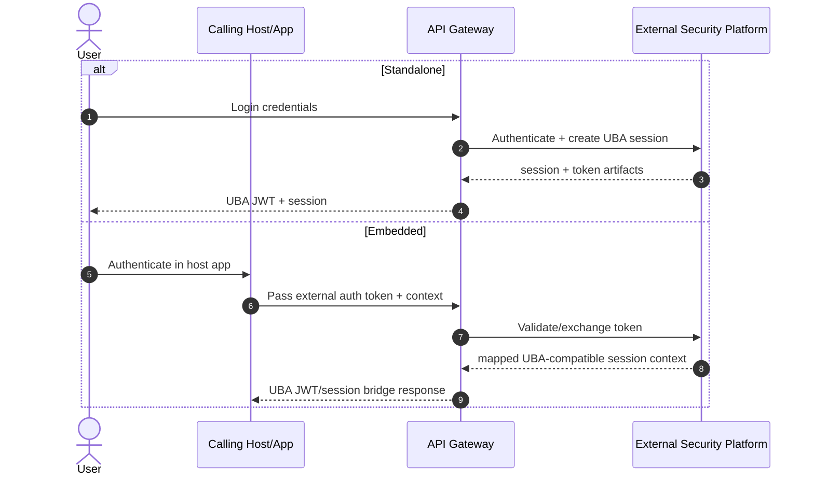

# System Context + Sequence Diagrams
## Teller UX Security and Gateway Flows (Standalone + Embedded)

**Version:** 1.0  
**Purpose:** Provide architecture context and executable sequence views for security/token/session behavior, including token reissue and drawer-selection edge cases.

---

## 1) System Context

### 1.1 Context Narrative
The Teller UX solution is a multi-tenant banking application where teller users authenticate through FI-specific ingress URLs. Requests are routed through a Spring API Gateway that orchestrates security calls to an external banking security platform, enriches headers, and forwards traffic to downstream services (user, drawer, transaction, integrated teller sync, etc.).

The platform supports:
- **Standalone flow:** JWT is generated directly in UBA flow.
- **Embedded flow:** External auth token is provided, then exchanged/bridged into UBA security context.

JWT tokens are intentionally kept lightweight (tenant + user UUID + role names + limited session refs). Expanded authorization data is placed in server-side cache keyed by user/session context.

---

### 1.2 System Context Diagram (Level 1)

```mermaid
flowchart LR
    Teller[Teller User\n(FI Employee)] --> Browser[Teller UX\n(Angular Web App)]
    Browser --> Ingress[Tenant-specific Ingress URL]
    Ingress --> Gateway[Spring API Gateway\nWebFlux + Token Orchestration]

    Gateway --> Security[External Banking Security Platform\nAuth/Session/OTP/User APIs]
    Gateway --> UserSvc[User/Role Service]
    Gateway --> DrawerSvc[Drawer Service]
    Gateway --> TxnSvc[Transaction Services]
    Gateway --> IntegratedTeller[Integrated Teller Adapter\n(drawer sync/cash data)]

    Gateway --> Redis[(Redis Cache\nPermissions + Session Context)]
    Gateway --> Console[Config/Console Cluster\nService Health + Routing]

    Console --> Gateway
    UserSvc --> Core[Core Banking / ESF]
    DrawerSvc --> Core
    TxnSvc --> Core

    Gateway --> Obs[Observability\nLogs/Metrics/Tracing]
```

---

## 2) Container/Responsibility View (Level 2)

| Component | Responsibility |
|---|---|
| Teller UX (Angular) | Login UX, drawer selection UX, session keepalive calls, transaction initiation |
| API Gateway (Spring WebFlux) | App token retrieval, downstream auth calls, header propagation, token verification/reissue trigger logic |
| External Security Platform | App token issuance, user login/logout, OTP, verify token, user API auth |
| User/Role Service | Role retrieval, profile enrichment, integrated teller linkage |
| Drawer Service | Drawer lookup, selection, branch association |
| Integrated Teller Adapter | Drawer cash synchronization and external teller data retrieval |
| Redis Cache | Expanded claims: permissions, branches, limits, access codes keyed by user UUID/session |
| Console/Config Cluster | Service registration, health check, runtime config distribution |

---

## 3) Sequence Diagrams

## 3.1 Login + Session Bootstrap (Base Flow)



---

## 3.2 Drawer Selection (Multi-Drawer Normal Path)



---

## 3.3 Drawer Selection Edge Case A — Single Drawer Auto-Select



---

## 3.4 Drawer Selection Edge Case B — Filter Reduces Drawers by Access Rules



---

## 3.5 Token Reissue Trigger at Gateway (URI-Based)



---

## 3.6 Embedded Flow vs Standalone Flow



---

## 4) Token + Cache Design Reference

### 4.1 JWT (Minimal Claims)
- user UUID
- tenant code
- role names
- session/teller/branch references (when known)
- expiry and token identifiers

### 4.2 Redis Cache (Expanded Context)
- permissions by role
- branch mappings
- drawer/teller enrichment
- access codes / limits / policy metadata
- timestamps/version metadata

### 4.3 Why This Pattern
- Keeps token size under proxy/header limits.
- Avoids repeated claim recomputation on every reissue.
- Speeds up policy lookups and branch-aware authorization.

---

## 5) Failure/Exception Paths (Key Cases)

| Scenario | Expected Behavior |
|---|---|
| App token retrieval fails | Gateway returns standardized upstream error; no downstream call |
| Login succeeds but profile enrichment fails | Return partial failure with correlation ID; do not issue full session context |
| Cache unavailable | Continue with minimal claims only for safe endpoints; block policy-critical flows |
| Drawer sync fails after token reissue | Return selected drawer context + async sync error handling strategy |
| Reissue triggered but claim build fails | Keep existing token, return safe error, avoid forwarding inconsistent context |

---

## 6) Implementation Notes for Teams

1. Maintain configurable URI list for token reissue triggers.
2. Keep drawer-filter and policy-evaluation logic deterministic and idempotent.
3. Ensure every response includes correlation/trace identifiers for support.
4. Add contract tests for the single-drawer auto-select and filtered-drawer edge cases.
5. Prefer cache refresh over recalculation when user UUID/session is unchanged.

